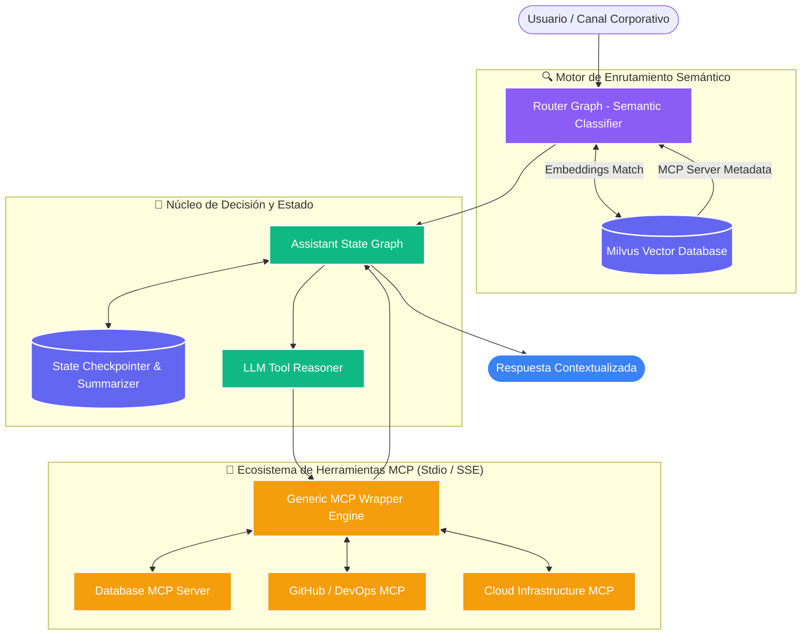
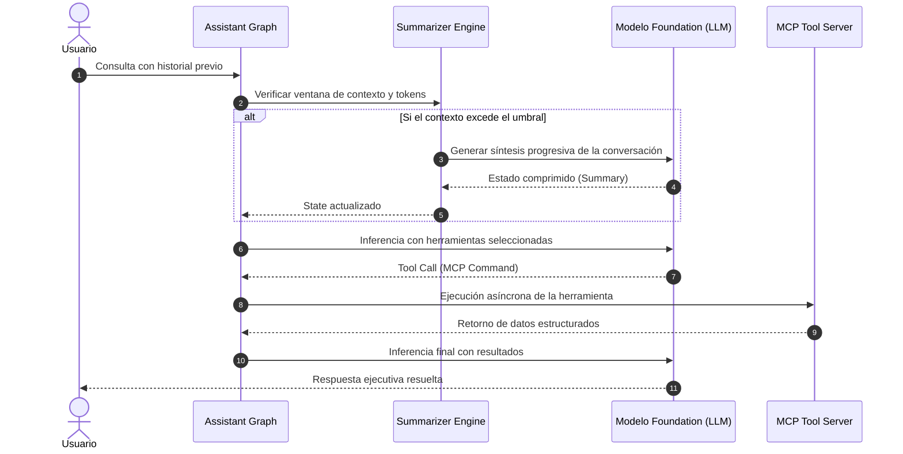

# Enterprise Universal Agent Platform (LangGraph + MCP)

[]()
[]()
[]()
[]()
[]()

## 📌 Resumen Ejecutivo
**LangGraph Agent Platform** es una arquitectura de orquestación multi-agente de nivel empresarial diseñada para integrar de forma desacoplada y estandarizada modelos de lenguaje avanzados (LLMs) con herramientas externas, APIs y bases de conocimiento mediante el **Model Context Protocol (MCP)**.

La solución implementa grafos dirigidos con memoria conversacional persistente (*State Graph with Summarization*), enrutamiento semántico dinámico mediante índices vectoriales (Milvus) y una capa de abstracción basada en el patrón *Strategy* para consumir servidores MCP locales o remotos (Stdio/SSE).

---

## 🏗️ Arquitectura de la Solución (Mermaid)



---

## 🔄 Flujo de Ejecución de la Memoria y Resumen



---

## 📚 Estructura de Componentes

```text
langgraph-mcp-agent/
├── src/
│   └── langgraph_mcp/
│       ├── assistant_graph.py                     # Grafo principal del asistente
│       ├── assistant_graph_with_summarization.py  # Grafo con gestión de memoria y síntesis
│       ├── build_router_graph.py                  # Generador del índice de enrutamiento
│       ├── configuration.py                       # Parámetros y schemas tipados
│       ├── mcp_wrapper.py                         # Wrapper genérico (Strategy Pattern)
│       ├── prompts.py                             # Plantillas de razonamiento
│       ├── retriever.py                           # Integración con Milvus Vector DB
│       ├── state.py                               # Modelos de estado tipados (Pydantic)
│       └── utils/                                 # Utilidades y conversores OpenAPI
├── tests/                                         # Batería de pruebas unitarias y de integración
├── langgraph.json                                 # Despliegue en LangGraph Cloud / Server
├── mcp-servers-config.sample.json                 # Configuración de topología de herramientas
└── README.md                                      # Documentación ejecutiva
```

---

## 🔐 Capacidades Enterprise
1. **Desacoplamiento Total:** Los agentes no requieren hardcodear herramientas; descubren dinámicamente capacidades leyendo el catálogo expuesto por los servidores MCP.
2. **Resiliencia de Memoria:** Manejo automático de conversaciones extensas mediante algoritmos de compresión y resumen en tiempo real.
3. **Escalabilidad Vectorial:** Capacidad para enrutar entre cientos de herramientas MCP sin saturar el contexto del modelo, gracias a la búsqueda por similitud en Milvus.
